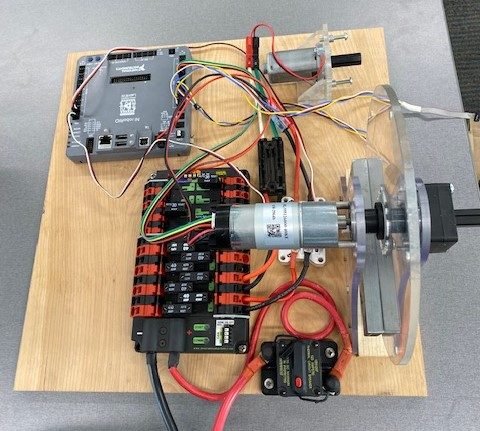

= Test Bench Examples
:source-highlighter: highlight.js
:xrefstyle: short
:stem:
:sectnums:
:idprefix:
:idseparator: -
:CPP: C++
:toc:

== Test Bench Description

The Test Bench was created to allow students wanting to learn FRC robot programming a way to do example problems without needing access to a functioning robot.  As you read these examples they will refer to terms and/or concepts that will not be familiar to you.  Stop and lookup what these unfamiliar terms/concepts mean as you go along.  

The test bench uses a https://docs.wpilib.org/en/stable/docs/software/roborio-info/roborio-introduction.html[RoboRIO 1] and a https://docs.wpilib.org/en/stable/docs/controls-overviews/control-system-hardware.html#ctre-power-distribution-panel[CTRE Power Distribution Panel].  It has two simple brushed motors (a https://www.andymark.com/products/neverest-classic-40-gearmotor[NeveRest with 40:1 gearbox] and a unknown motor) connected to two different motor controllers (a https://docs.wpilib.org/en/stable/docs/controls-overviews/control-system-hardware.html#spark-motor-controller[SPARK] and a https://docs.wpilib.org/en/stable/docs/controls-overviews/control-system-hardware.html#victor-sp[Victor SP]).  Both motor controllers are controlled with PWM. The "Position Control" motor is the NeveRest motor that is connected to a large disc.  The "Velocity Control" motor is the other small generic motor.

The "Velocity Control" motor is connected to the https://docs.wpilib.org/en/stable/docs/controls-overviews/control-system-hardware.html#victor-sp[Victor SP] motor controller which is wired into the roboRIO PWM channel 0.  It has a https://store.ctr-electronics.com/srx-mag-encoder/[SRX Mag Encoder] attached to its output shaft.  The SRX is wired into the roboRIO DIO channels 0, 1, and 2.  Channels 0 & 1 are the Quadrature A and B inputs and channel 2 is the absolute PWM signal.

The "Position Control" motor is connected to the https://docs.wpilib.org/en/stable/docs/controls-overviews/control-system-hardware.html#spark-motor-controller[SPARK] motor controller which is wired into the roboRIO PWM channel 1.  The position control motor has a built-in encoder and it also has a https://store.ctr-electronics.com/srx-mag-encoder/[SRX Mag Encoder] attached to its output shaft.  The SRX is wired into the roboRIO DIO channels 3, 4, and 5. Channels 3 & 4 are the Quadrature A and B inputs and channel 5 is the absolute PWM signal. The built-in encoder is wired into Channels 6 and 7.

The Test Bench does not have a WiFi radio so the coding computer must be connected to the roboRIO with a USB cable (USB A to USB B).  The Test Bench must also be powered by a robot battery.

.The Test Bench

== Percent Output Example

In this example we will be creating a "Timed Robot" program to set the position motor's percent output based on the position of a joystick.

Launch "WPILib VS Code" from the desktop.  This runs VS Code with the WPILib libraries and tools enabled. https://docs.wpilib.org/en/stable/docs/software/vscode-overview/creating-robot-program.html[Follow these directions to create a blank project from the "Timed Skeleton (Advanced)" template].

You should now have an empty project.  The two files that we will be working with are `src/main/include/Robot.h` and `src/main/cpp/Robot.cpp`.  Find those files in the Explorer on the left sidebar of VS Code and open `Robot.h`.  It contains the `Robot` class which declares (See https://www.learncpp.com/cpp-tutorial/forward-declarations/[Forward Declarations and Definitions]) the `Robot-`, `Autonomous-`, `Teleop-`, `Disabled-`, `Test-`, and `Simulation-` Init() and Periodic() functions.

.Contents of Generated Robot.h
[source,C++]
----
// Copyright (c) FIRST and other WPILib contributors.
// Open Source Software; you can modify and/or share it under the terms of
// the WPILib BSD license file in the root directory of this project.

#pragma once

#include <frc/TimedRobot.h>

class Robot : public frc::TimedRobot {
 public:
  void RobotInit() override;
  void RobotPeriodic() override;

  void AutonomousInit() override;
  void AutonomousPeriodic() override;

  void TeleopInit() override;
  void TeleopPeriodic() override;

  void DisabledInit() override;
  void DisabledPeriodic() override;

  void TestInit() override;
  void TestPeriodic() override;

  void SimulationInit() override;
  void SimulationPeriodic() override;
};
----

For this simple example we won't need most of the Init() and Periodic() functions so delete all the declared functions except `RobotInit()` and `TeleopPeriodic()`.  `RobotInit()` runs once when the code first starts and `TeleopPeriodic()` runs every 20 milliseconds while the  Driver Station is in Teleop Mode.

We need to add member variables to the `Robot` class for our motor controller and for a joystick.  The motor controller on the velocity motor is a https://docs.wpilib.org/en/stable/docs/controls-overviews/control-system-hardware.html#spark-motor-controller[Spark] controller so we will be using the https://github.wpilib.org/allwpilib/docs/release/cpp/classfrc_1_1_spark.html[`frc::Spark`] class.  Open the https://github.wpilib.org/allwpilib/docs/release/cpp/classfrc_1_1_spark.html[`frc::Spark` class API documentation] which will show what methods are available with the https://github.wpilib.org/allwpilib/docs/release/cpp/classfrc_1_1_spark.html[`frc::Spark`] class and what header needs to be included to use the class.  In the API documentation for https://github.wpilib.org/allwpilib/docs/release/cpp/classfrc_1_1_spark.html[`frc::Spark`] only the constructor that takes the PWM channel is shown along with the default constructor and the assignment operator.  Expand the `Public Member Functions inherited from frc::PWMMotorController` section to see more member functions that are available that are inherited from the `frc::PWMMotorController` class which is a base class of `frc::VictorSP` (See xref:CPP_Lessons.adoc#object-orientation[Object Orientation]).  In `Robot.h` add a private section to the `Robot` class that declares a `frc::VictorSP` variable and initialized the channel to one. Also add a https://github.wpilib.org/allwpilib/docs/release/cpp/classfrc_1_1_joystick.html[`frc::Joystick`] variable initialized to port zero. Add the two headers that are needed for the new classes.

.Robot.h after changes
[source,C++]
----
// Copyright (c) FIRST and other WPILib contributors.
// Open Source Software; you can modify and/or share it under the terms of
// the WPILib BSD license file in the root directory of this project.

#pragma once

#include <frc/TimedRobot.h>
#include <frc/motorcontrol/Spark.h>
#include <frc/Joystick.h>

class Robot : public frc::TimedRobot {
 public:
  void RobotInit() override;
  void TeleopPeriodic() override;
 private:
  frc::Spark m_motor{1};
  frc::Joystick m_joystick{0};
};
----

The `src/main/cpp/Robot.cpp` file has the definitions of the Init() and Periodic() functions for the `Robot` class. Remove all the Init() and Periodic() functions except `RobotInit()` and `TeleopPeriodic()`.  Now add the line shown below to `TeleopPeriodic()` which sets the motor percent output (-1 to 1 value) to the value of the X-axis on the joystick.

.Robot.cpp after modifications
[source,C++]
----
// Copyright (c) FIRST and other WPILib contributors.
// Open Source Software; you can modify and/or share it under the terms of
// the WPILib BSD license file in the root directory of this project.

#include "Robot.h"

void Robot::RobotInit() {}

void Robot::TeleopPeriodic() {
  m_motor.Set( m_joystick.GetX() );
}

#ifndef RUNNING_FRC_TESTS
int main() {
  return frc::StartRobot<Robot>();
}
#endif
----

Compile the project and make sure there are no errors.  Then connect to the test bench with a USB cable and power the test bench. Connect a joystick to the coding laptop and run the Driver Station.  Now deploy the code to the roboRIO.  Select `Teleop` on the driver station and press `Enable`.  The joystick should control the speed of the motor.

=== Adding an Encoder

We are going to add the built-in encoder to our program so we can see how many revolutions the motor has turned and how fast it is turning.  In `Robot.h`, use the https://github.wpilib.org/allwpilib/docs/release/cpp/classfrc_1_1_encoder.html[`frc::Encoder`] class to declare a variable for the encoder on channels 6 and 7.

.Changes to Robot.h
[source,C++]
----
  // Add the following header:
#include <frc/Encoder.h>

... 

    // Add a private member variable such as:
  frc::Encoder m_enc{ 6, 7 };
----

=== Visualizing What is Happening

The `Shuffleboard` program is used to communicate with the roboRIO.  The roboRIO can send information to `Shuffleboard` and `Shuffleboard` can be used to send information to the roboRIO.  The https://github.wpilib.org/allwpilib/docs/release/cpp/classfrc_1_1_smart_dashboard.html[`frc::SmartDashboard`] class is one method to communicate with `Shuffleboard`.  We will use the *static* member functions of the https://github.wpilib.org/allwpilib/docs/release/cpp/classfrc_1_1_smart_dashboard.html[`frc::SmartDashboard`] class to add information about the motor and the joystick position to `Shuffleboard`. 

[sidebar%collaspable]
****
*{CPP}* classes with *static* member functions are used like regular functions. You do not create instances of the class. See https://www.learncpp.com/cpp-tutorial/static-member-functions/[Static Member Functions]
****

Modify `Robot.cpp` to the following:

[source,C++]
----
#include "Robot.h"
#include <frc/smartdashboard/SmartDashboard.h>

void Robot::RobotInit() {
  frc::SmartDashboard::PutData( "Velocity Motor", &m_motor );
  frc::SmartDashboard::PutData( "Encoder", &m_enc );
}

void Robot::TeleopPeriodic() {
  double x_axis = m_joystick.GetX();

  frc::SmartDashboard::PutNumber( "Joystick X-axis", x_axis );
  m_motor.Set( x_axis );
}

#ifndef RUNNING_FRC_TESTS
int main() {
  return frc::StartRobot<Robot>();
}
#endif
----

Compile and deploy the code to the test bench.  Run shuffleboard and select the "SmartDashboard" tab.  Select `Teleop` in the Driver Station and `Enable` the roboRIO.  As you move the joystick, `Shuffleboard` will display the joystick output, the motor percent output (which should be the same), and the encoder position and velocity.

== Position Control Exercise

The Percent Output Example (<<percent-output-example>>) above is the most simplistic way of controlling a motor.  Percent output control cannot perform the kinds of control that are needed for almost all robotic systems.  This project will move a motor to a specified position and hold it there.  It will use P-control (position-control) to maintain the desired position which is a *feedback* control algorithm.

If you haven't already, read the xref:README.adoc#motion-control[Motion Control] section and watch the "PID Video, Part 1" in the first part of that section.  This example builds on the project that was created in <<percent-output-example>> so you will need the code from that project.  

=== P-Controller

The video in the first part of the xref:README.adoc#motion-control[Motion Control] section does a good job of describing what a P-controller does but I will reiterate it here.  The idea is to measure the current position of the robot mechanism (*y*) and then take the difference between the desired position (*r*) and the current position (*y*) and consider this the current error (*e*).  We then set the motor percent output to this error multiplied by a constant to scale things correctly.

[.text-center]
****
Motor Output = *K~p~* * *e* = *K~p~* * ( *r* - *y* )
****

* #TASK 1# -- Modify the code to hold the position 0 while the button *A* is held down and then move to the position 500 when the *B* button is held down.  Write the P-controller yourself as is done in video "PID Video, Part 1" in the xref:README.adoc#motion-control[Motion Control] section and determine a decent estimate for the *K~p~* constant.

=== Shuffleboard Graphs

Read the https://docs.wpilib.org/en/stable/docs/software/dashboards/shuffleboard/index.html[Shuffleboard^] documentation and in particular https://docs.wpilib.org/en/stable/docs/software/dashboards/shuffleboard/getting-started/shuffleboard-graphs.html[Working with Graphs].

* #TASK 2# -- Graph the desired position and the actual encoder position in `Shuffleboard` as you move from the 0 position to the 500 position and back.  Note whether the actual position gets exactly to the desired position.

=== Relative Encoder Limitations

Disable the robot and manually move the position motor to a new position then restart the robot code by going to Diagnostics->Restart Robot Code in the Driver Station.  Rerun the code and notice that the 0 position (and 500 position) are not in the same location as the last time the code was run. This is due to the fact that the encoder we are using is a relative encoder that does not really know where the motor shaft position is but only know how far it has moved from the last time is was powered on.

=== Homing Switch

A homing switch can be used to put a motor with a relative encoder into a known location.  This is commonly done on inexpensive CNC mills and routers that use stepper motors.  Currently the Test Bench does not have a homing switch to use.

=== Absolute Encoder

* #TASK 3# -- Modify the code to use the SRX Mag Encoder's absolute PWM signal to always move to the same 0 position. Use the https://github.wpilib.org/allwpilib/docs/release/cpp/classfrc_1_1_duty_cycle_encoder.html[`frc::DutyCycleEncoder`] class. 

=== Real Angular Units

* #TASK 4# -- Modify the code to move to locations based on angles in degrees.  You will need to determine the units that are returned from the encoder class that you are using (e.g. `frc::DutyCycleEncoder` or `frc::Encoder`).

=== PID Controller Class

* #TASK 5# -- Use the https://github.wpilib.org/allwpilib/docs/release/cpp/classfrc2_1_1_p_i_d_controller.html[`frc2::PIDController`] class to implement the P-control.

== Trapezoidal Motion Exercise

== Velocity Control Exercise
 

